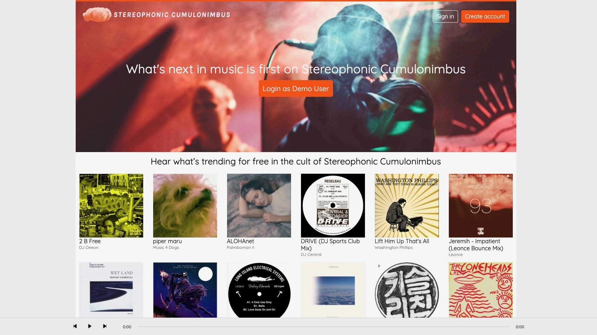
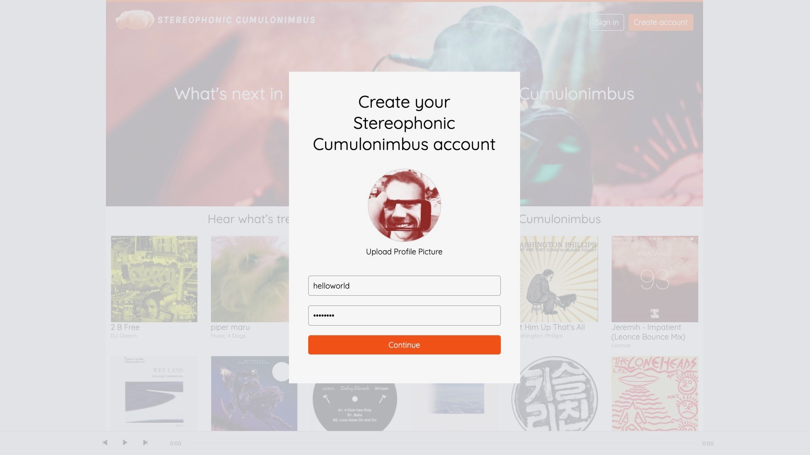
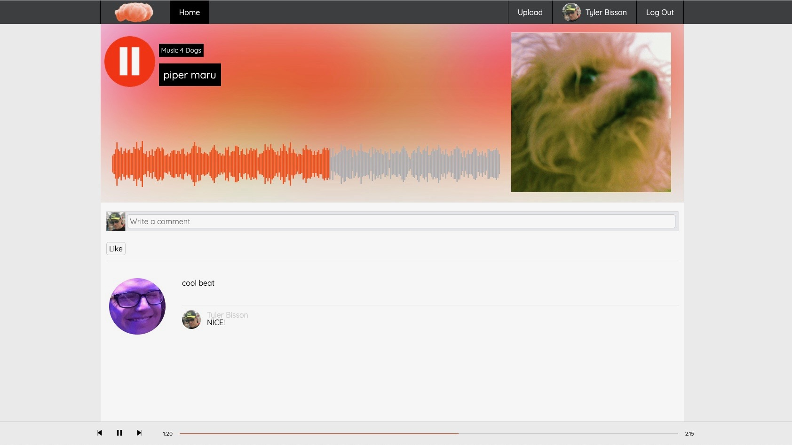
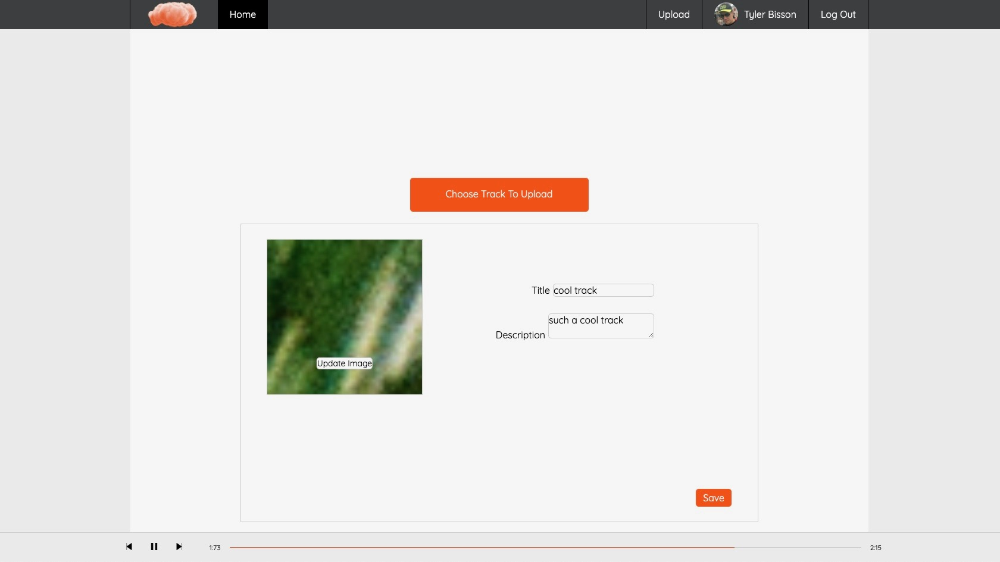

# Stereophonic Cumulonimbus

Stereophonic Cumulonimbus live link

Stereophonic Cumulonimbus is full-stack, single-page app in homage to SoundCloud. Users can stream music, comment on their favorite tracks, and upload their own recordings 

The frontend state is managed with React and Redux and the backend utilizes Ruby on Rails. ActiveStorage and AWS work to manage audio and image assets. 

## Tech 

### Frontend
* Javascript
* React
* Redux
* Webpack
* HTML5 
* CSS

### Backend
* Ruby
* Ruby on Rails
* Jbuilder
* Postgresql
* AWS S3 (production, development, & seeding buckets)

## Features 

#### Styled in homage to soundcloud 

#### Full user authentication

#### Continuous audio playback throughout inter-component navigation 

#### Full CRUD for recordings 

